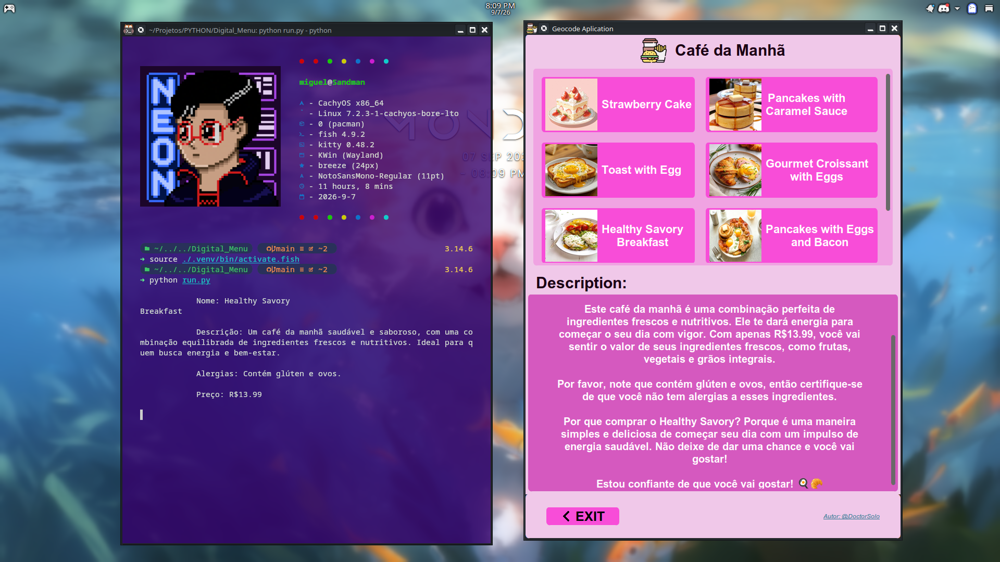

<h1 align="center">Digital Menu</h1>

<p align="center">
  This aplication has many options of breakfast and AI features
</p>

<h3 align="center">Setting Up the Environment</h3>

I recommend creating a virtual environment for this project. Run the following commands in your terminal:

```bash
# Create the virtual environment
python -m venv .venv

# Activate it (Linux/macOS)
source ./.venv/bin/activate

# If the above doesn't work, try:
source ./.venv/bin/activate.fish

# On Windows, use:
# .venv\Scripts\activate
```

Next, install the required dependencies:

```bash
pip install -r requirements.txt
```

> **Note:** Make sure the file is named `requirements.txt` (the original had a typo).

##

<h3 align="center">Cloning the Repository</h3>

If you have Git installed, use one of the following commands to clone the project:

**HTTPS:**

```bash
git clone https://github.com/DoctorSolo/Digital-Menu-With-Python.git
```

**SSH:**

```bash
git clone git@github.com:DoctorSolo/Digital-Menu-With-Python.git
```

##

<h3 align="center">How to Use</h3>

This project offers two usage options:

- **Graphical Interface (GUI):** Run the `main.py` file to launch the application. You will be prompted to enter latitude and longitude coordinates. After clicking **Enter**, the location information will be displayed in the main window, and a separate window will open showing the map of the region.

- **Command Line (CLI):** [Add CLI instructions here if applicable]

##

<h3 align="center">Usage Example</h3>

**Input Coordinates:** `48.858844, 2.294351`

**Output:**  
`Paris - IDF, France`



##

<h3 align="center">Credits</h3>

-  Icon created by [Magnific](https://www.flaticon.com/br/autores/magnific) available at [Flaticon](https://www.flaticon.com/br/icone-gratis/comida-rapida_15371194?related_id=15371194)
-  Icon created by [Roundicons](https://www.flaticon.com/br/autores/roundicons) available at [Flaticon](https://www.flaticon.com/br/icone-gratis/seta-esquerda_271220?term=seta-esquerda&page=1&position=4&origin=search&related_id=271220)

##

<table align=center>
  <tr>
    <th><h3 align=center>Miguel Eduado</h3></th>
    <th><h3 align=center>🐼 - Follow Me</h3></th>
  </tr>
  <tr>
    <td>
        
    </td>
    <td>
        <div align="center"> 
          <a href="https://github.com/DoctorSolo">
            
          </a>
          <a href="https://bsky.app/profile/doctorsolo.bsky.social">
            
          </a>
          <a href="https://www.linkedin.com/in/migueledu303/">
            
          </a>
          <a href="https://discord.com/users/534808726570270731/">
            
          </a>
          <a href="https://dr-solo.itch.io/">
            
          </a>
        </div>
    </td>
  </tr>
</table>
